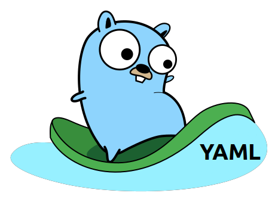

# yaml2go

[](https://travis-ci.org/PrasadG193/yaml2go)

Converts YAML specs into Go type definitions



## Installation

### Binary Installation

Pre-compiled binaries are available on the releases page. You can download the correct binary depending on your system arch, put it into $PATH and hit `yaml2go help`

### Install From Source

#### Step 1: Clone the repo
```bash
$ git clone https://github.com/PrasadG193/yaml2go.git $GOPATH/src/github.com/PrasadG193/yaml2go
```

#### Step 2: Build binary using go install
```bash
$ go install $GOPATH/src/github.com/PrasadG193/yaml2go
```

#### Step 3: Convert YAML specs into Go type

```bash
$ cat example1.yaml
kind: test
metadata:
  name: cluster
  nullfield:
  nestedstruct:
  - nested:
      underscore_field: value
      field1:
      - 44.5
      - 43.6
      field2:
      - true
      - false
    nested2:
      - nested3:
          field1:
          - 44
          - 43
          fieldt:
          - true
          - false
          field3: value
abc:
  - def:
    - black
    - white
array1:
  - "string1"
  - "string2"
array2:
  - 2
  - 6
array3:
  - 3.14
  - 5.12
is_underscore: true
```

```bash
$ GOPATH/bin/yaml2go < example1.yaml
// Yaml2Go
type Yaml2Go struct {
        Kind         string    `yaml:"kind"`
        Metadata     Metadata  `yaml:"metadata"`
        Abc          []Abc     `yaml:"abc"`
        Array1       []string  `yaml:"array1"`
        Array2       []int     `yaml:"array2"`
        Array3       []float64 `yaml:"array3"`
        IsUnderscore bool      `yaml:"is_underscore"`
}

// Metadata
type Metadata struct {
        Name         string         `yaml:"name"`
        Nullfield    interface{}    `yaml:"nullfield"`
        Nestedstruct []Nestedstruct `yaml:"nestedstruct"`
}

// Nested3
type Nested3 struct {
        Field1 []int  `yaml:"field1"`
        Fieldt []bool `yaml:"fieldt"`
        Field3 string `yaml:"field3"`
}

// Abc
type Abc struct {
        Def []string `yaml:"def"`
}

// Nestedstruct
type Nestedstruct struct {
        Nested  Nested    `yaml:"nested"`
        Nested2 []Nested2 `yaml:"nested2"`
}

// Nested
type Nested struct {
        UnderscoreField string    `yaml:"underscore_field"`
        Field1          []float64 `yaml:"field1"`
        Field2          []bool    `yaml:"field2"`
}

// Nested2
type Nested2 struct {
        Nested3 Nested3 `yaml:"nested3"`
}
```

## Usage

#### Show help

```bash
yaml2go --help
yaml2go converts YAML specs to Go type definitions

Usage:
    yaml2go < /path/to/yamlspec.yaml

Examples:
    yaml2go < test/example1.yaml
    yaml2go < test/example1.yaml > example1.go
```

#### Convert yaml spec to Go struct

```bash
$ yaml2go < example.yaml
```
e.g

```bash
$ cat example1.yaml
kind: test
metadata:
  name: cluster
  nullfield:
  nestedstruct:
  - nested:
      underscore_field: value
      field1:
      - 44.5
      - 43.6
      field2:
      - true
      - false
    nested2:
      - nested3:
          field1:
          - 44
          - 43
          fieldt:
          - true
          - false
          field3: value
abc:
  - def:
    - black
    - white
array1:
  - "string1"
  - "string2"
array2:
  - 2
  - 6
array3:
  - 3.14
  - 5.12
is_underscore: true
```

```bash
$ GOPATH/bin/yaml2go < example1.yaml
// Yaml2Go
type Yaml2Go struct {
        Kind         string    `yaml:"kind"`
        Metadata     Metadata  `yaml:"metadata"`
        Abc          []Abc     `yaml:"abc"`
        Array1       []string  `yaml:"array1"`
        Array2       []int     `yaml:"array2"`
        Array3       []float64 `yaml:"array3"`
        IsUnderscore bool      `yaml:"is_underscore"`
}

// Metadata
type Metadata struct {
        Name         string         `yaml:"name"`
        Nullfield    interface{}    `yaml:"nullfield"`
        Nestedstruct []Nestedstruct `yaml:"nestedstruct"`
}

// Nested3
type Nested3 struct {
        Field1 []int  `yaml:"field1"`
        Fieldt []bool `yaml:"fieldt"`
        Field3 string `yaml:"field3"`
}

// Abc
type Abc struct {
        Def []string `yaml:"def"`
}

// Nestedstruct
type Nestedstruct struct {
        Nested  Nested    `yaml:"nested"`
        Nested2 []Nested2 `yaml:"nested2"`
}

// Nested
type Nested struct {
        UnderscoreField string    `yaml:"underscore_field"`
        Field1          []float64 `yaml:"field1"`
        Field2          []bool    `yaml:"field2"`
}

// Nested2
type Nested2 struct {
        Nested3 Nested3 `yaml:"nested3"`
}
```

## Contributing

We love your input! We want to make contributing to this project as easy and transparent as possible, whether it's:
- Reporting a bug
- Discussing the current state of the code
- Submitting a fix
- Proposing new features

## Credits
The Go Gopher is originally by [Renee French](http://reneefrench.blogspot.com/)

This artwork is borrowed from an awesome artwork collection by [Egon Elbre](https://github.com/egonelbre/gophers)
